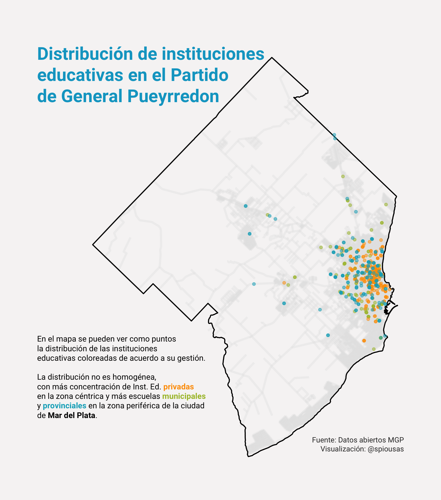

# Bienvenidxs a mi repositorio de 30 días de mapas 2021!

Mi nombres es Ignacio Spiousas y en esta edición me propongo hacer 30
mapas utilizando los datos abiertos del Municipio de General Pueyrredon
(Buenos Aires, Argentina), tratando de que cada mapa tenga un mensaje
claro y consiso sobre Mar del Plata y su zona.

### Día 1 - Puntos

Establecimientos educativos en el Partido de General Pueyrredon. [Code
here!](https://github.com/spiousas/30DayMapChallenge_2021/blob/main/Day1/Escuelas_en_MdP.R)

[Full
size](https://github.com/spiousas/30DayMapChallenge_2021/blob/main/Day1/Escuelas_MGP.png)

### Día 2 - Líneas

Arroyos del Partido de General Pueyrredon. [Code
here!](https://github.com/spiousas/30DayMapChallenge_2021/blob/main/Day2/Arroyos.R)

[Full
size](https://github.com/spiousas/30DayMapChallenge_2021/blob/main/Day2/Arroyos_MGP.png)

### Día 3 - Polígonos

Arroyos del Partido de General Pueyrredon. [Code
here!](https://github.com/spiousas/30DayMapChallenge_2021/blob/main/Day3/Radios_censales.R)

[Full
size](https://github.com/spiousas/30DayMapChallenge_2021/blob/main/Day3/Radios_censales_MGP.png)

### Día 4 - Hexágonos

Luminarias de la ciudad de Mar del Plata por tipo. [Code
here!](https://github.com/spiousas/30DayMapChallenge_2021/blob/main/Day4/Luminarias_MdP.R)

[Full
size](https://github.com/spiousas/30DayMapChallenge_2021/blob/main/Day4/Luminarias_MdP.png)

### Día 5 - Data challenge 1: OpenStreetMap

Restaurantes, heladerías y bares de la ciudad de Mar del Plata de
acuerdo a Open Street Maps. [Code
here!](https://github.com/spiousas/30DayMapChallenge_2021/blob/main/Day5/OSM.R)

[Full
size](https://github.com/spiousas/30DayMapChallenge_2021/blob/main/Day5/OSM.png)

### Días 6, 7 y 8 - Rojo, Verde y Azul

Recorridos de las líneas de colectivo de Mar del Plata por color. [Code
here!](https://github.com/spiousas/30DayMapChallenge_2021/blob/main/Day6-7-8/MDP_bus.R)

[Full
size](https://github.com/spiousas/30DayMapChallenge_2021/blob/main/Day6-7-8/MDP_bus.png)

### Días 9 - Monocromático

Elevación de Sierra de los Padres inspirado en la tapa del Unknown
Pleasures de Joy Division. [Code
here!](https://github.com/spiousas/30DayMapChallenge_2021/blob/main/Day9/Unknown_Sierras.R)

[Full
size](https://github.com/spiousas/30DayMapChallenge_2021/blob/main/Day9/Unknown_Sierras.png)
