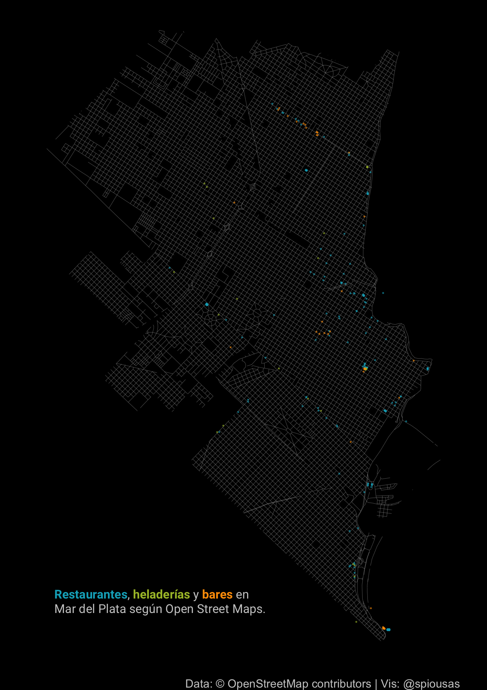
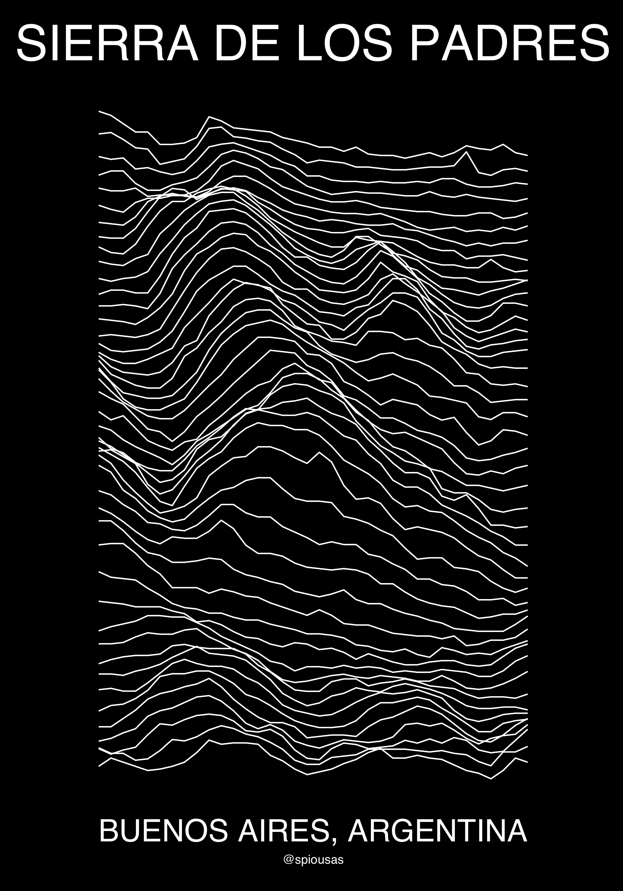

```{r setup, include=FALSE}
library(emo)
library(png)
library(tidyverse)
library(knitr)
knitr::opts_chunk$set(
  collapse = TRUE,
  echo = TRUE,
  comment = "#>",
  fig.path = "man/figures/README-",
  out.width = "100%",
  dpi = 800
)
options(tibble.print_min = 5, tibble.print_max = 5)
```

# Bienvenidxs a mi repositorio de 30 días de mapas 2021!


[](https://twitter.com/spiousas)

Mi nombres es Ignacio Spiousas y en esta edición me propongo hacer 30 mapas utilizando los datos abiertos del Municipio de General Pueyrredon (Buenos Aires, Argentina), tratando de que cada mapa tenga un mensaje claro y consiso sobre Mar del Plata y su zona.

### Día 1 - Puntos

Establecimientos educativos en el Partido de General Pueyrredon. [Code here!](https://github.com/spiousas/30DayMapChallenge_2021/blob/main/Day1/Escuelas_en_MdP.R)

```{r, echo = FALSE, out.width="60%"}
include_graphics("./Day1/Escuelas_MGP.png")
```

[Full size](https://github.com/spiousas/30DayMapChallenge_2021/blob/main/Day1/Escuelas_MGP.png)

### Día 2 - Líneas

Arroyos del Partido de General Pueyrredon. [Code here!](https://github.com/spiousas/30DayMapChallenge_2021/blob/main/Day2/Arroyos.R)

```{r, echo = FALSE, out.width="60%"}
include_graphics("./Day2/Arroyos_MGP.png")
```

[Full size](https://github.com/spiousas/30DayMapChallenge_2021/blob/main/Day2/Arroyos_MGP.png)

### Día 3 - Polígonos

Arroyos del Partido de General Pueyrredon. [Code here!](https://github.com/spiousas/30DayMapChallenge_2021/blob/main/Day3/Radios_censales.R)

```{r, echo = FALSE, out.width="60%"}
include_graphics("./Day3/Radios_censales_MGP.png")
```

[Full size](https://github.com/spiousas/30DayMapChallenge_2021/blob/main/Day3/Radios_censales_MGP.png)

### Día 4 - Hexágonos

Luminarias de la ciudad de Mar del Plata por tipo. [Code here!](https://github.com/spiousas/30DayMapChallenge_2021/blob/main/Day4/Luminarias_MdP.R)

```{r, echo = FALSE, out.width="60%"}
include_graphics("./Day4/Luminarias_MdP.png")
```

[Full size](https://github.com/spiousas/30DayMapChallenge_2021/blob/main/Day4/Luminarias_MdP.png)


### Día 5 - Data challenge 1: OpenStreetMap

Restaurantes, heladerías y bares de la ciudad de Mar del Plata de acuerdo a Open Street Maps. [Code here!](https://github.com/spiousas/30DayMapChallenge_2021/blob/main/Day5/OSM.R)

```{r, echo = FALSE, out.width="60%"}

```

[Full size](https://github.com/spiousas/30DayMapChallenge_2021/blob/main/Day5/OSM.png)

### Días 6, 7 y 8 - Rojo, Verde y Azul

Recorridos de las líneas de colectivo de Mar del Plata por color. [Code here!](https://github.com/spiousas/30DayMapChallenge_2021/blob/main/Day6-7-8/MDP_bus.R)

```{r, echo = FALSE, out.width="60%"}
include_graphics("./Day6-7-8/MdP_bus.png")
```

[Full size](https://github.com/spiousas/30DayMapChallenge_2021/blob/main/Day6-7-8/MDP_bus.png)

### Día 9 - Monocromático

Elevación de Sierra de los Padres inspirado en la tapa del Unknown Pleasures de Joy Division. [Code here!](https://github.com/spiousas/30DayMapChallenge_2021/blob/main/Day9/Unknown_Sierras.R)

```{r, echo = FALSE, out.width="60%"}

```

[Full size](https://github.com/spiousas/30DayMapChallenge_2021/blob/main/Day9/Unknown_Sierras.png)

### Día 10 - Raster

Elevación de Playa Grande y Cabo Corrientes con estética **Vaporwave**. [Code here!](https://github.com/spiousas/30DayMapChallenge_2021/blob/main/Day10/MardelVaporwave.R)

```{r, echo = FALSE, out.width="60%"}

```

[Full size](https://github.com/spiousas/30DayMapChallenge_2021/blob/main/Day10/MardelVaporwave.png)

### Días 11 - 3D

La densidad de población por fracción censal del MGP en 3D. [Code here!](https://github.com/spiousas/30DayMapChallenge_2021/blob/main/Day11/Poblacion3D.R)

```{r, echo = FALSE, out.width="60%"}

```

[Full size](https://github.com/spiousas/30DayMapChallenge_2021/blob/main/Day11/Poblacion3D.png)

### Días 11 - Población

La densidad de población por fracción censal del MGP en 2D. [Code here!](https://github.com/spiousas/30DayMapChallenge_2021/blob/main/Day12/Poblacion2D.R)

```{r, echo = FALSE, out.width="60%"}

```

[Full size](https://github.com/spiousas/30DayMapChallenge_2021/blob/main/Day12/Poblacion2D.png)