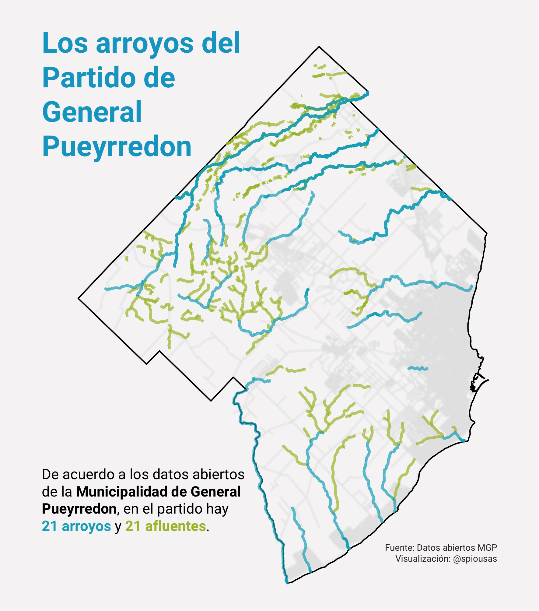

```{r setup, include=FALSE}
library(emo)
library(png)
library(tidyverse)
library(knitr)
knitr::opts_chunk$set(
  collapse = TRUE,
  echo = TRUE,
  comment = "#>",
  fig.path = "man/figures/README-",
  out.width = "100%",
  dpi = 800
)
options(tibble.print_min = 5, tibble.print_max = 5)
```

# Bienvenidxs a mi repositorio de 30 días de mapas 2021!


[](https://twitter.com/spiousas)

Mi nombres es Ignacio Spiousas y en esta edición me propongo hacer 30 mapas utilizando los datos abiertos del Municipio de General Pueyrredon (Buenos Aires, Argentina), tratando de que cada mapa tenga un mensaje claro y consiso sobre Mar del Plata y su zona.

## Día 1: Puntos

Establecimientos educativos en el Partido de General Pueyrredon.
```{r, echo = FALSE}
include_graphics("./Day1/Escuelas_MGP.png")
```
[Code here](https://github.com/spiousas/30DayMapChallenge_2021/blob/main/Day1/Escuelas_en_MdP.R)

## Día 2: Líneas

Arroyos del Partido de General Pueyrredon.
```{r, echo = FALSE}

```
[Code here](https://github.com/spiousas/30DayMapChallenge_2021/blob/main/Day2/Arroyos.R)

## Día 2: Polígonos

Arroyos del Partido de General Pueyrredon.
```{r, echo = FALSE}
include_graphics("./Day3/Radios_censales_MGP.png")
```
[Code here](https://github.com/spiousas/30DayMapChallenge_2021/blob/main/Day3/Radios_censales.R)